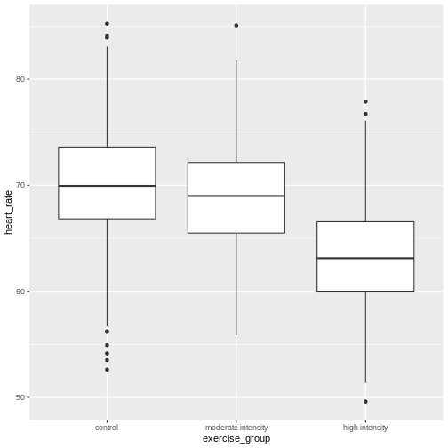

::::::::::::::::::::::::::::::::::::::: objectives

- CRD is the simplest experimental design.
- In CRD, treatments are assigned randomly to experimental units.
- CRD assumes that the experimental units are relatively homogeneous or similar.
- CRD doesn't remove or account for systematic differences among experimental units.

::::::::::::::::::::::::::::::::::::::::::::::::::

:::::::::::::::::::::::::::::::::::::::: questions

- What is a completely randomized design (CRD)?
- What are the limitations of CRD?

::::::::::::::::::::::::::::::::::::::::::::::::::


A completely randomized design (CRD) is the simplest experimental design. In 
CRD, experimental units are randomly assigned to treatments with equal 
probability. Any systematic differences between experimental units (e.g. 
differences in measurement protocols, equipment calibration, personnel) are
minimized, which minimizes confounding. CRD is simple, however it can result in 
larger experimental error compared to other designs if experimental units are 
not similar. This means that the variation among experimental units that receive
the same treatment (i.e. variation within a treatment group) will be greater. In
general though, CRD is a straightforward experimental design that effectively minimizes systematic errors through randomization.

## A single qualitative factor
The [Generation 100 study](https://bmjopen.bmj.com/content/5/2/e007519)
employed a single qualitative factor (exercise) at three treatment levels - high
intensity, moderate intensity and a control group that followed national 
exercise recommendations. The experimental units were the individuals in the
study who engaged in one of the treatment levels.

:::::::::::::::::::::::::::::::::::::::  challenge

## Challenge 1: Raw ingredients of a comparative experiment

Discuss the following questions with your partner, then share your answers
to each question in the collaborative document.

1. How would you randomize the 1,500+ individuals in the study to one of the
treatment levels?  
2. Is blinding possible in this study? If not, what are the consequences of
not blinding the participants or investigators to treatment assignments?  
3. Is CRD a good design for this study? Why or why not?  

:::::::::::::::  solution

## Solution

1. How would you randomize the 1,500+ individuals in the study to one of the
treatment levels?  
You can use a random number generator like we did previously to assign all
individuals to one of three treatment levels.  
2. Is blinding possible in this study? If not, what are the consequences of
not blinding the participants or investigators to treatment assignments?  
Blinding isn't possible because people must know which treatment they have been
assigned so that they can exercise at the appropriate level. There is a risk of
response bias from participants knowing which treatment they have been assigned.
The investigators don't need to know which treatment group an individual is in,
however, so they could be blinded to the treatments to prevent reporting bias 
from entering when following study protocols. In either case random assignment
of participants to treatment levels will minimize bias.  
3. Is CRD a good design for this study? Why or why not?  
CRD is best when experimental units are homogeneous or similar. In this study,
all individuals were between the ages of 70-77 years and all lived in 
Trondheim, Norway. They were not all of the same sex, however, and sex will
certainly affect the study outcomes and lead to greater experimental error
within each treatment group. Stratification, or grouping, by sex followed by 
random assignment to treatments within each stratum would alleviate this 
problem. So, randomly assigning all women to one of the three treatment groups, 
then randomly assigning all men to one of the three treatment groups would be 
the best way to handle this situation.  
In addition to stratification by sex, the Generation 100 investigators 
stratified by marital status because this would also influence study outcomes.

:::::::::::::::::::::::::

::::::::::::::::::::::::::::::::::::::::::::::::::

## Analysis of variance (ANOVA)
Previously we tested the difference in means between two treatment groups, 
moderate intensity and control, using a two-sample t-test. We could continue 
using the t-test to determine whether there is a significant difference between 
high intensity and moderate intensity, and between high intensity and control 
groups. This would be tedious though because we would need to test each possible
combination of two treatment groups separately. It is also susceptible to bias.
If we were to test the difference in means between the highest and lowest heart
rate groups (high intensity vs. control), there is more than a 5% probability 
that just by random chance we can obtain a p-value less than .05. Comparing the 
highest to the lowest mean groups biases the t-test to report a statistically 
significant difference when in reality there might be no difference in means.

Analysis of variance (ANOVA) addresses two sources of variation in the data:
1) the variation within each treatment group; and 2) the variation among the
treatment groups. In the boxplots below, the variation within each treatment
group shows in the vertical length of the each box and its whiskers. The 
variation among treatment groups is shown horizontally as upward or
downward shift of the treatment groups relative to one another. ANOVA quantifies
and compares these two sources of variation.


``` r
heart_rate %>% mutate(exercise_group = fct_reorder(exercise_group, 
                                                   heart_rate, 
                                                   .fun='mean', 
                                                   .desc = TRUE))  %>% 
  ggplot(aes(exercise_group, heart_rate)) + 
  geom_boxplot()
```


By eye it appears that there is a difference in mean heart rate between exercise
groups, and that increasing exercise intensity decreases mean heart rate. We 
want to know if there is any statistically significant difference between mean 
heart rates in the three exercise groups. The R function `anova()` performs
analysis of variance (ANOVA) to answer this question. We provide `anova()` with
a linear model (`lm()`) stating that heart rate depends on exercise group.


``` r
anova(lm(heart_rate ~ exercise_group, data = heart_rate))
```

``` output
Analysis of Variance Table

Response: heart_rate
                 Df Sum Sq Mean Sq F value    Pr(>F)    
exercise_group    2  12673  6336.7  250.84 < 2.2e-16 ***
Residuals      1564  39510    25.3                      
---
Signif. codes:  0 '***' 0.001 '**' 0.01 '*' 0.05 '.' 0.1 ' ' 1
```

The output tells us that there are two terms in the model we provided: exercise 
group plus some experimental error (residuals). The Sum of Squares (`Sum Sq`) 
for the treatment (exercise group) subtracts the overall mean for all groups
(68) from each individual observation,
squares the difference so that only positive numbers result, then sums all of 
the squared differences together and multiplies the result by the number of
observations in each group (391.75). 
In the boxplots below, imagine drawing a vertical line from the overall mean
(68) to an individual data point in the
control group. Square this line by adding sides of the same length to create a
box. Calculate the area of the box (the length of the line squared). Repeat this
for all data points in the group, then sum up the areas of all 
391.75 boxes. Repeat the process with the 
other two groups, then multiply the total by 
391.75. This used to be a manual process.
Fortunately R does all of this labor for us.


Exercise group has 2 degrees of freedom, one less than the number of exercise 
groups. Think of degrees of freedom as the number of values that are free to 
vary. Or, if you know two of the exercise groups, the identity of the third is 
revealed. The mean squares values for the treatment (`Mean Sq`) divides the
sum of squares by the degrees of freedom
(1.2673\times 10^{4} / 
2 = 
6336.72). 
The treatment mean square is a measure of the variance among the treatment 
groups, which is shown horizontally in the boxplots as upward or downward shift 
of the treatment groups relative to one another.

The degrees of freedom for the residuals is equal to the number of groups 
(4) times one less than the number 
of observations in each group (390.75), 
or 1564.
The sum of squares for the residuals subtracts the group mean, not the overall
mean, from each data point in that group, squares the difference, sums all of
the squares for that group, then sums all of the squares for all groups. The
total sum of squares for the errors 
(3.951\times 10^{4})
is divided by the residual degrees of freedom
(1564) to
produce the error mean square. Error mean square is an estimate of variance
within the groups, which is shown in the vertical length of the each boxplot and 
its whiskers.

The `F value`, or F statistic, equals the treatment mean square divided by the
error mean square, or among-group variation divided by within-group variation
(6337 /
25 = 
250.84).

`F value` = among-group variance / within-group variance

These variance estimates are statistically independent of one another, such that 
you could move any of the three boxplots up or down and this would not affect 
the within-group variance. Among-group variance would change, but not 
within-group variance. 


## Equal variances and normality

## Confidence intervals

## Inference

## Prediction intervals

## Design issues


:::::::::::::::::::::::::::::::::::::::: keypoints

- CRD is a simple design that can be used when experimental units are homogeneous.

::::::::::::::::::::::::::::::::::::::::::::::::::


