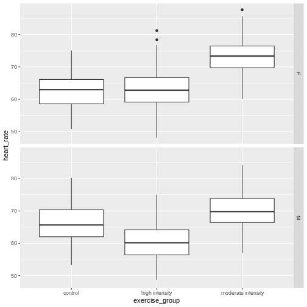
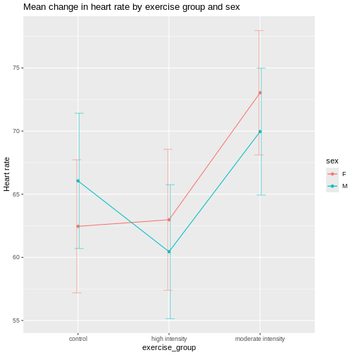

::::::::::::::::::::::::::::::::::::::: objectives

- A randomized complete block design randomizes treatments to experimental units within the block.
- Blocking increases the precision of treatment comparisons.

::::::::::::::::::::::::::::::::::::::::::::::::::

:::::::::::::::::::::::::::::::::::::::: questions

- What is randomized complete block design?

::::::::::::::::::::::::::::::::::::::::::::::::::


Blocking of experimental units, as presented in an earlier episode on 
[Experimental Design Principles](https://carpentries-incubator.github.io/statistical-experimental-design/design-principles.html#controlling-natural-variation-with-blocking),
can be critical for successful and valuable experiments. Blocking increases
precision in treatment comparisons relative to an unblocked experiment with the
same experimental units. A randomized block design can be thought of as a set
of separate completely randomized designs for comparing the same treatments. 
Each member of the set is a block, and within this block, each of the treatments
is randomly assigned. We can assess treatment differences within each block
and determine whether treatment differences are consistent from block to block.
In other words, we can determine whether there is an interaction between block 
and treatment.

## Design issues
The first issue to consider in this case is whether or not to block the
experiment. Blocks serve to control natural variation among experimental units,
and randomization within blocks accounts for "nuisance" variables or traits that 
are likely associated with the response. Shelf height and resulting differences
in illumination is one example of a nuisance variable. Other variables like age 
and sex are characteristics of experimental units that can influence the 
treatment response. Blocking by sex and/or age is a best practice in 
experimental design.

In an earlier episode on
[Completely Randomized Designs](https://carpentries-incubator.github.io/statistical-experimental-design/complete-random-design.html),
we presented the Generation 100 Study of 3 exercise treatments on men and
women from 70 to 77 years of age. In the actual study, participants were
stratified (blocked) by sex and cohabitation status (living with someone vs.
living alone) to form 4 blocks. The three treatment levels (control, moderate-
and high-intensity exercise) were randomly assigned within each block. As such,
we would **analyze** the experiment **as designed** in blocks. Let's revisit
these data with blocking by sex in mind. Read in the data again if needed.


``` r
heart_rate <- read_csv("data/simulated_heart_rates.csv")
```

View the heart rate data separated by sex.


``` r
heart_rate %>% ggplot(aes(exercise_group, heart_rate)) + 
  geom_boxplot() + 
  facet_grid(rows = vars(sex))
```



Each panel in the plot above is one block, one for females, one for males.
What patterns do you see?
Does there appear to be a difference in heart rates between sexes? between
exercise groups? between sexes and exercise groups?

Let's extract the means and standard deviations for exercise groups by sex.


``` r
g100meansSD <- heart_rate %>%
  group_by(sex, exercise_group) %>%
  summarise(meanChange = round(mean(heart_rate), 3),
            stDev = sd(heart_rate))
g100meansSD
```

``` output
# A tibble: 6 × 4
# Groups:   sex [2]
  sex   exercise_group     meanChange stDev
  <chr> <chr>                   <dbl> <dbl>
1 F     control                  62.5  5.27
2 F     high intensity           63.0  5.58
3 F     moderate intensity       73.0  4.92
4 M     control                  66.1  5.36
5 M     high intensity           60.4  5.30
6 M     moderate intensity       70.0  5.02
```

Use these summary statistics in an interaction plot to determine if there is an
interaction between exercise (treatment) and sex (block).


``` r
ggplot(g100meansSD, aes(x=exercise_group, y=meanChange, group=sex, color=sex)) + 
    geom_line() +
    geom_point() +
    geom_errorbar(aes(ymin=meanChange-stDev, ymax=meanChange+stDev), width=.2,
                  position=position_dodge(0.05), alpha=.5) +
  labs(y = "Heart rate",
       title = "Mean change in heart rate by exercise group and sex") 
```



It appears that there is an interaction between exercise and sex given that the
lines cross over one another. The effect of exercise is different depending on
sex. The F-test from an ANOVA will tell us whether this apparent interaction is 
real or random, specifically whether it is more pronounced than would be 
expected due to random variation.


``` r
anova(lm(heart_rate ~ exercise_group*sex, data = heart_rate))
```

``` output
Analysis of Variance Table

Response: heart_rate
                     Df Sum Sq Mean Sq  F value  Pr(>F)    
exercise_group        2  26960 13480.1 489.6147 < 2e-16 ***
sex                   1    176   175.6   6.3779 0.01165 *  
exercise_group:sex    2   3587  1793.7  65.1510 < 2e-16 ***
Residuals          1560  42950    27.5                     
---
Signif. codes:  0 '***' 0.001 '**' 0.01 '*' 0.05 '.' 0.1 ' ' 1
```
As before, we read the ANOVA table from the bottom up starting with the 
interaction `exercise_group:sex`. Since the interaction is significant, you 
should not compare sexes across exercise groups because the exercise effects are 
not the same across sexes. They are different for each sex.

The ANOVA table looks similar to the previous example involving drug dose and 
exercise in mice. There is an important distinction between the two ANOVA 
tables, however. In the drug dose and exercise ANOVA table, the interaction was 
between two treatments - drug dose and exercise. In this ANOVA table, the 
interaction is between **block** and **treatment**. The block, sex, is not a 
treatment. It's a characteristic of the experimental units. In the drug dose 
experiment, the experimental units (mice) are homogeneous and the treatments 
were randomized to the experimental units once only in a completely randomized 
design. In this case, the experimental units are heterogeneous and a separate 
randomization of treatments was applied to each block of experimental units. 
This is a randomized block design.


<!-- Imagine that you want to evaluate the effect of different doses of a new drug on the proliferation of cancer cell lines in vitro. You use -->
<!-- four different cancer cell lines because you would like the results to -->
<!-- generalize to many types of cell lines. Divide each of the cell lines into four -->
<!-- treatment groups, each with the same number of cells. Each treatment group -->
<!-- receives a different dose of the drug for five consecutive days. -->

<!-- Group 1: Control (no drug)   -->
<!-- Group 2: Low dose (10 μM) -->
<!-- Group 3: Medium dose (50 μM) -->
<!-- Group 4: High dose (100 μM) -->

<!-- ```{r} -->

<!-- # create treatment levels -->
<!-- f <- factor(c("control", "low", "medium", "high")) -->

<!-- # create random orderings of the treatment levels -->
<!-- block1 <- sample(f, 4) -->
<!-- block2 <- sample(f, 4) -->
<!-- block3 <- sample(f, 4) -->
<!-- block4 <- sample(f, 4) -->
<!-- treatment <- c(block1, block2, block3, block4) -->
<!-- block <- factor(rep(c("cellLine1", "cellLine2", "cellLine3", "cellLine4"), each = 4)) -->
<!-- dishnum <- rep(1:4, 4) -->
<!-- plan <- data.frame(cellLine = block, DishNumber = dishnum, treatment = treatment) -->
<!-- plan -->
<!-- ``` -->

<!-- When analyzing a random complete block design, the effect of the block is -->
<!-- included in the equation along with the effect of the treatment. -->

## Sizing a randomized block experiment

## True replication

## Balanced incomplete block designs


:::::::::::::::::::::::::::::::::::::::: keypoints

- Replication, randomization and blocking determine the validity and usefulness of an experiment.

::::::::::::::::::::::::::::::::::::::::::::::::::


