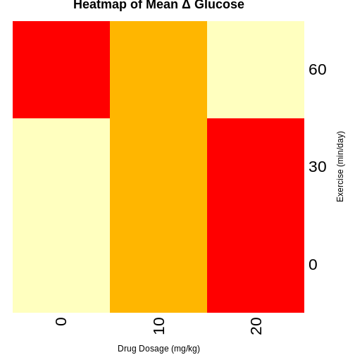
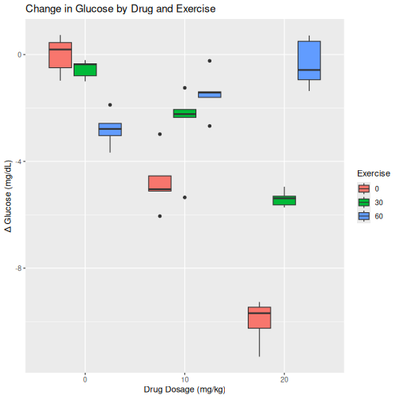
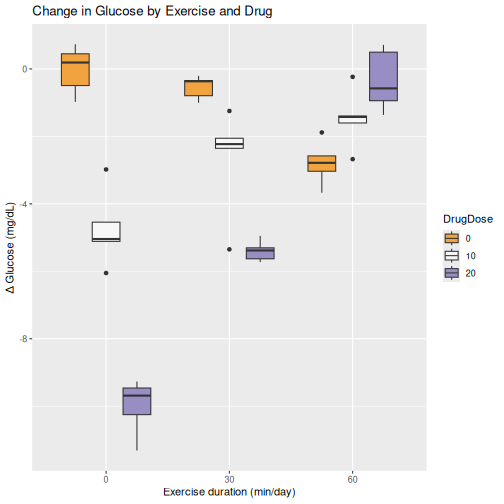
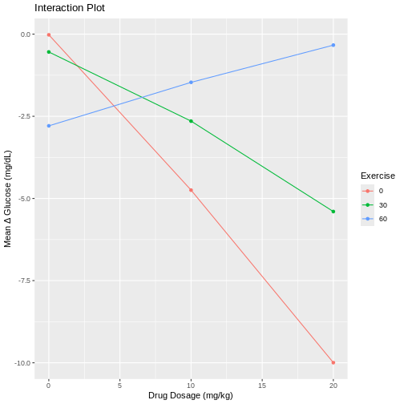
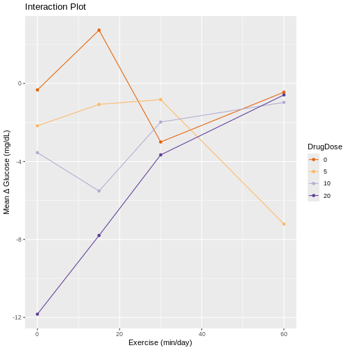

::::::::::::::::::::::::::::::::::::::: objectives

- .
- .

::::::::::::::::::::::::::::::::::::::::::::::::::

:::::::::::::::::::::::::::::::::::::::: questions

- How is a CRD with more than one treatment factor designed and analyzed?

::::::::::::::::::::::::::::::::::::::::::::::::::

When experiments are structured with two or more factors, these factors can be
qualitative or quantitative. With two or more factors we face the same design
issues. Which factors to choose? Which levels for each factor? A full factorial
experiment includes all levels of all factors, which can become unwieldy when
there are multiple levels for each factor. One option to manage an unwieldy 
design is to use only a fraction of the factor levels in a fractional factorial
design. In this lesson we consider a full factorial design containing all levels
of all factors.


A study aims to determine how dosage of a hypoglycemic drug and duration of 
daily exercise affect blood glucose levels in diabetic mice. The study has two 
quantitative factors with four levels each.


Drug dosage represents the amount of a new antidiabetic drug administered daily.
The levels for this factor are in mg per kg body weight. Control mice receive no
drug. The second factor, exercise duration, represents the number of minutes the 
mice run on a running wheel each day. Control mice do not have a running wheel 
to run on. A full factorial design is used, with each combination of drug dosage 
and exercise duration applied to a group of mice. For example, one group 
receives 5 mg/kg of the drug and exercises 15 minutes per day, another group
receives 5 mg/kg and exercises 30 minutes per day, and so on.

There are 4 levels for each factor, leading to 16 treatment combinations (4 drug 
doses × 4 exercise durations). Each combination is replicated with a group of 5 
mice, making the design balanced and allowing analysis of interactions. Fasting 
blood glucose level (mg/dL) was measured at the start and after 4 weeks of
treatment.
Load the data and summarize by mean change in glucose levels (`Delta`).


``` r
drugExercise <- read_csv("data/drugExercise.csv")
drugExercise$DrugDose <- as_factor(drugExercise$DrugDose)
drugExercise$Exercise <- as_factor(drugExercise$Exercise)

drugExercise %>%
   group_by(DrugDose, Exercise) %>%
  summarise(ChangeGlucose = mean(Delta))
```

``` output
# A tibble: 16 × 3
# Groups:   DrugDose [4]
   DrugDose Exercise ChangeGlucose
   <fct>    <fct>            <dbl>
 1 0        0               -0.331
 2 0        15               2.73 
 3 0        30              -3.00 
 4 0        60              -0.445
 5 5        0               -2.17 
 6 5        15              -1.07 
 7 5        30              -0.827
 8 5        60              -7.21 
 9 10       0               -3.55 
10 10       15              -5.51 
11 10       30              -1.98 
12 10       60              -0.969
13 20       0              -11.8  
14 20       15              -7.80 
15 20       30              -3.66 
16 20       60              -0.586
```

A heatmap is a good way to visualize the table of mean glucose changes. It shows
the greatest changes with a drug dose of 20 mg/kg for 3 of the 4 exercise 
groups. The 5 mg/kg drug dosage group also shows a large change, but only when
combined with 60 minutes of exercise per day.



Boxplots show the same pattern for 5 mg/kg drug dosage group
combined with 60 minutes of exercise per day. They also show an increase in mean glucose with increasing exercise for the 20 mg/kg drug dosage group.


``` r
ggplot(drugExercise, aes(x = DrugDose, y = Delta, fill = Exercise)) +
  geom_boxplot() +
  labs(title = "Change in Glucose by Drug and Exercise",
       y = "Δ Glucose (mg/dL)", x = "Drug Dosage (mg/kg)")
```



Boxplots with exercise on the x-axis are not as easy to interpret since patterns
for combinations of exercise and drug dose aren't so apparent. Greater
variability for some groups is apparent however. The length of the boxplots for the 0 mg/kg and 5 mg/kg drug dose groups indicates high within-group 
variability. The 20 mg/kg boxplots are more compact, indicating lesser variability within this group.


``` r
ggplot(drugExercise, aes(x = Exercise, y = Delta, fill = DrugDose)) +
  geom_boxplot() +
  labs(title = "Change in Glucose by Exercise and Drug",
       y = "Δ Glucose (mg/dL)", x = "Exercise duration (min/day)") +
  scale_fill_brewer(palette = "PuOr") # use a different color palette
```



## Interaction between factors
We could analyze these data as if it were simply a completely randomized design
with 16 treatments (4 drug doses and 4 exercise durations). The ANOVA would have 
15 degrees of freedom for treatments and the F-test would tell us whether the 
variation among average changes in glucose levels for the 16 treatments was real 
or random. However, the factorial treatment structure lets us separate out the 
variability in glucose level changes among drug doses averaged over exercise 
durations. The ANOVA table would provide a sum of squares based on 3 degrees of 
freedom for the difference between the 4 treatment means ($\bar{y}_i$) and the 
pooled (overall) mean ($\bar{y}$).  

Sum of squares for 16 treatments $= n\sum(\bar{y}_i - \bar{y})^2$. 

The sum of squares would capture the variability among the 4 drug dose levels.
The variation among the 4 exercise levels would be captured similarly, with 3
degrees of freedom. That leaves 15 - 6 = 9 degrees of freedom left over. What 
variability do these remaining 9 degrees of freedom contain? The answer is
interaction - the interaction between drug doses and exercise durations. Mean 
changes in glucose for each of the 16 treatments is given in the table below.

<table>
 <thead>
<tr>
<th style="empty-cells: hide;border-bottom:hidden;" colspan="2"></th>
<th style="border-bottom:hidden;padding-bottom:0; padding-left:3px;padding-right:3px;text-align: center; " colspan="3"><div style="border-bottom: 1px solid #ddd; padding-bottom: 5px; ">Drug Dose</div></th>
</tr>
  <tr>
   <th style="text-align:left;"> Exercise </th>
   <th style="text-align:right;"> 0 </th>
   <th style="text-align:right;"> 5 </th>
   <th style="text-align:right;"> 10 </th>
   <th style="text-align:right;"> 20 </th>
  </tr>
 </thead>
<tbody>
  <tr>
   <td style="text-align:left;"> 0 </td>
   <td style="text-align:right;"> -0.3 </td>
   <td style="text-align:right;"> -2.2 </td>
   <td style="text-align:right;"> -3.5 </td>
   <td style="text-align:right;"> -11.8 </td>
  </tr>
  <tr>
   <td style="text-align:left;"> 15 </td>
   <td style="text-align:right;"> 2.7 </td>
   <td style="text-align:right;"> -1.1 </td>
   <td style="text-align:right;"> -5.5 </td>
   <td style="text-align:right;"> -7.8 </td>
  </tr>
  <tr>
   <td style="text-align:left;"> 30 </td>
   <td style="text-align:right;"> -3.0 </td>
   <td style="text-align:right;"> -0.8 </td>
   <td style="text-align:right;"> -2.0 </td>
   <td style="text-align:right;"> -3.7 </td>
  </tr>
  <tr>
   <td style="text-align:left;"> 60 </td>
   <td style="text-align:right;"> -0.4 </td>
   <td style="text-align:right;"> -7.2 </td>
   <td style="text-align:right;"> -1.0 </td>
   <td style="text-align:right;"> -0.6 </td>
  </tr>
</tbody>
</table>

We can visualize interactions for all combinations of drug dose and exercise 
duration with an interaction plot that shows mean change in glucose levels.


``` r
# Interaction plot
interaction_plot <- drugExercise %>%
  group_by(DrugDose, Exercise) %>%
  summarise(MeanChange = mean(Delta), .groups = "drop")

ggplot(interaction_plot, aes(x = as.numeric(as.character(DrugDose)),
                             y = MeanChange,
                             color = Exercise, group = Exercise)) +
  geom_line() +
  geom_point() +
  labs(title = "Interaction Plot",
       x = "Drug Dosage (mg/kg)",
       y = "Mean Δ Glucose (mg/dL)")
```



The interaction plot shows wide variation in mean glucose changes among the 
groups at a drug dose of 20 mg/kg. As we saw earlier with the boxplots, mean glucose increased with increasing exercise. For the 0 and 15 minute/day exercise groups, increasing drug dosage led to decreasing mean glucose levels. For the 30 and 60 minute/day exercise groups, increasing drug dosage did not decrease mean glucose levels appreciably, with one exception. At 5 mg/kg dosage, the 60 minute/day exercise group saw a strong decrease in mean blood glucose.  

If we plot exercise on the x-axis, the same patterns show up differently.


``` r
ggplot(interaction_plot, aes(x = as.numeric(as.character(Exercise)),
                             y = MeanChange,
                             color = DrugDose, group = DrugDose)) +
  geom_line() +
  geom_point() +
  labs(title = "Interaction Plot",
       x = "Exercise (min/day)",
       y = "Mean Δ Glucose (mg/dL)") +
  scale_color_brewer(palette = "PuOr") # use a different color palette
```



This second interaction plot shows wide variation in mean glucose changes within the 0 min/day exercise group, showing that an increase in drug dosage decreased
mean glucose. For the 60 min/day exercise group, mean glucose change was nearly
equal with the exception of the 5 mg/kg drug dosage group. At 5 mg/kg dosage, 
the 60 minute/day exercise group saw a strong decrease in mean blood glucose. At a drug dose of 20 mg/kg, increasing exercise led to increased mean glucose.   

If lines were parallel we could assume no interaction between drug and exercise. 
Since they are not  parallel we should assume interaction between exercise and 
drug dose. The F-test from an ANOVA will tell us whether this apparent 
interaction is real or random, specifically whether it is more pronounced than 
would be expected due to random variation.


``` r
# DrugDose*Exercise is the interaction
anova(lm(Delta ~ DrugDose + Exercise + DrugDose*Exercise, 
         data = drugExercise))
```

``` output
Analysis of Variance Table

Response: Delta
                  Df  Sum Sq Mean Sq F value   Pr(>F)   
DrugDose           3  327.00 109.000  4.7193 0.004885 **
Exercise           3   61.10  20.367  0.8818 0.455334   
DrugDose:Exercise  9  573.94  63.771  2.7611 0.008576 **
Residuals         64 1478.18  23.097                    
---
Signif. codes:  0 '***' 0.001 '**' 0.01 '*' 0.05 '.' 0.1 ' ' 1
```

We can read the ANOVA table from the bottom up, starting with the interaction
(`DrugDose:Exercise`). The `F value` for the interaction is 
2.76
on 
9
and 
64
degrees of freedom for the interaction and error (`Residuals`) respectively. The 
p-value (`Pr(>F)`) is very low and as such the interaction between exercise and
drug dose is significant, backing up what we see in the interaction plots.  

If we move up a row in the table to `Exercise`, the F test compares the mean
changes across drug dose groups. The `F value` for exercise is 
0.88
on 
3
and 
64
degrees of freedom for exercise and residuals respectively. The p-value is high 
at
0.455
and so exercise is not significant. Finally, we move up to the row containing
`DrugDose` to find an F value of 
4.72
and a very low p-value again. Drug dose averaged over exercise is significant.  

A summary of the linear model reiterates the observations we see in the plots
and ANOVA.


``` r
summary(lm(Delta ~ DrugDose + Exercise + DrugDose*Exercise, 
           data = drugExercise))
```

``` output

Call:
lm(formula = Delta ~ DrugDose + Exercise + DrugDose * Exercise, 
    data = drugExercise)

Residuals:
     Min       1Q   Median       3Q      Max 
-10.5399  -2.9481   0.4131   3.5483   9.2899 

Coefficients:
                      Estimate Std. Error t value Pr(>|t|)    
(Intercept)            -0.3308     2.1493  -0.154 0.878153    
DrugDose5              -1.8403     3.0395  -0.605 0.547011    
DrugDose10             -3.2169     3.0395  -1.058 0.293873    
DrugDose20            -11.5002     3.0395  -3.784 0.000343 ***
Exercise15              3.0651     3.0395   1.008 0.317051    
Exercise30             -2.6698     3.0395  -0.878 0.383040    
Exercise60             -0.1145     3.0395  -0.038 0.970065    
DrugDose5:Exercise15   -1.9659     4.2985  -0.457 0.648978    
DrugDose10:Exercise15  -5.0321     4.2985  -1.171 0.246073    
DrugDose20:Exercise15   0.9708     4.2985   0.226 0.822041    
DrugDose5:Exercise30    4.0134     4.2985   0.934 0.353982    
DrugDose10:Exercise30   4.2388     4.2985   0.986 0.327797    
DrugDose20:Exercise30  10.8381     4.2985   2.521 0.014191 *  
DrugDose5:Exercise60   -4.9237     4.2985  -1.145 0.256295    
DrugDose10:Exercise60   2.6928     4.2985   0.626 0.533244    
DrugDose20:Exercise60  11.3591     4.2985   2.643 0.010333 *  
---
Signif. codes:  0 '***' 0.001 '**' 0.01 '*' 0.05 '.' 0.1 ' ' 1

Residual standard error: 4.806 on 64 degrees of freedom
Multiple R-squared:  0.3942,	Adjusted R-squared:  0.2523 
F-statistic: 2.777 on 15 and 64 DF,  p-value: 0.00235
```

`DrugDose20` is significant, as are the interactions between 20 mg/kg dosage and
30 and 60 min/day exercise groups.  

The partitioning of treatments sums of squares into main effect (average) and 
interaction sums of squares is a result of the crossed factorial structure
(orthogonality) of the two factors. The complete combinations of these two
factors provides clean partitioning between main effects and interactions. This
is not to say that designs that don't have full combinations of factors can't be
analyzed to estimate main effects and interactions. They can be using 
generalized linear models.  
The development of efficient and informative multifactor designs that cleanly
separate main effects from interactions is one of the most important
contributions of statistical experimental design.

:::::::::::::::::::::::::::::::::::::::: keypoints

- Completely randomized designs can be structured with two or more factors.
- Random assignment of treatments to experimental units in a single homogeneous group is the same.
- Factorial structure of the experiment requires different analyses, primarily
ANOVA.

::::::::::::::::::::::::::::::::::::::::::::::::::


