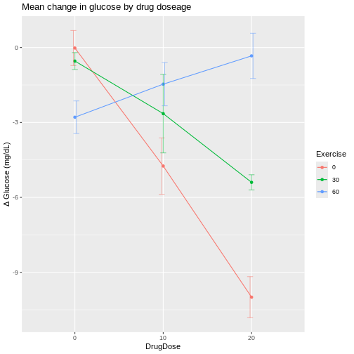
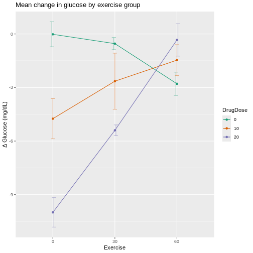

::::::::::::::::::::::::::::::::::::::: objectives

- .
- .

::::::::::::::::::::::::::::::::::::::::::::::::::

:::::::::::::::::::::::::::::::::::::::: questions

- How is a CRD with more than one treatment factor designed and analyzed?

::::::::::::::::::::::::::::::::::::::::::::::::::

When experiments are structured with two or more factors, these factors can be
qualitative or quantitative. With two or more factors we face the same design
issues. Which factors to choose? Which levels for each factor? A full factorial
experiment includes all levels of all factors, which can become unwieldy when
there are multiple levels for each factor. One option to manage an unwieldy 
design is to use only a fraction of the factor levels in a fractional factorial
design. In this lesson we consider a full factorial design containing all levels
of all factors.


A study aims to determine how dosage of a new antidiabetic drug and duration of 
daily exercise affect blood glucose levels in diabetic mice. The study has two 
quantitative factors with three levels each.


Drug dosage represents the amount of the antidiabetic drug administered daily.
The levels for this factor are in mg per kg body weight. Control mice receive no
drug. The second factor, exercise duration, represents the number of minutes the 
mice run on a running wheel each day. Control mice do not have a running wheel 
to run on. A full factorial design is used, with each combination of drug dosage 
and exercise duration applied to a group of mice. For example, one group 
receives 10 mg/kg of the drug and exercises 30 minutes per day, another group
receives 10 mg/kg and exercises 60 minutes per day, and so on.

There are 3 levels for each factor, leading to 9 treatment combinations (3 drug 
doses × 3 exercise durations). Each combination is replicated with a group of 5 
mice, making the design balanced and allowing analysis of interactions. Fasting 
blood glucose level (mg/dL) was measured at the start and after 4 weeks of
treatment.
Load the data. 


``` r
drugExercise <- read_csv("data/drugExercise.csv")
```

``` output
Rows: 45 Columns: 5
── Column specification ────────────────────────────────────────────────────────
Delimiter: ","
dbl (5): DrugDose, Exercise, Baseline, Delta, Post

ℹ Use `spec()` to retrieve the full column specification for this data.
ℹ Specify the column types or set `show_col_types = FALSE` to quiet this message.
```

``` r
drugExercise$DrugDose <- as_factor(drugExercise$DrugDose)
drugExercise$Exercise <- as_factor(drugExercise$Exercise)
head(drugExercise)
```

``` output
# A tibble: 6 × 5
  DrugDose Exercise Baseline  Delta  Post
  <fct>    <fct>       <dbl>  <dbl> <dbl>
1 0        0            228.  0.449  228.
2 0        0            274. -0.977  273.
3 0        0            236.  0.190  236.
4 0        0            236.  0.731  237.
5 0        0            220  -0.493  220.
6 10       0            246. -5.04   241.
```

Summarize by mean change in glucose levels (`Delta`) and standard deviation.


``` r
meansSD <- drugExercise %>%
  group_by(Exercise, DrugDose) %>%
  summarise(meanChange = round(mean(Delta), 1),
            stDev = sd(Delta))
meansSD
```

``` output
# A tibble: 9 × 4
# Groups:   Exercise [3]
  Exercise DrugDose meanChange stDev
  <fct>    <fct>         <dbl> <dbl>
1 0        0               0   0.702
2 0        10             -4.7 1.13 
3 0        20            -10   0.824
4 30       0              -0.5 0.339
5 30       10             -2.6 1.57 
6 30       20             -5.4 0.305
7 60       0              -2.8 0.652
8 60       10             -1.5 0.866
9 60       20             -0.3 0.905
```

The table shows that the drug alone lowered glucose in the mice in the 0 min/day
exercise group. Increasing drug dose also lowered glucose in the 30 min/day
exercise group. The 60 min/day exercise group showed the opposite effect. As
drug dose increased, average change in glucose diminished.

Boxplots show that exercise alone appears to lower glucose in the mice that were 
not given the drug. The greatest glucose changes are with a drug dose of 20 
mg/kg for 2 of the 3 exercise groups - 0 and 30 minutes of exercise per day. At 
60 minutes of exercise a day combined with 20 mg/kg drug dose, change in glucose 
levels are zero and don't seem to have much effect. 


``` r
ggplot(drugExercise, aes(x = DrugDose, y = Delta, fill = Exercise)) +
  geom_boxplot() +
  labs(title = "Change in Glucose by Drug and Exercise",
       y = "Δ Glucose (mg/dL)", x = "Drug Dosage (mg/kg)")
```


This pattern is repeated for the 10 mg/kg drug dose, where less exercise leads
to greater change in glucose levels and more exercise leads to smaller changes.
However, each boxplot shows outliers as dots extending above and below the 
boxes. This makes it difficult to determine if there really is a difference in 
glucose levels since there is so much overlap between the boxplots and their 
outliers. In fact, the spread of the data (standard deviation) at 10 mg/kg
drug dose are among the largest values in the entire data set. With only 5 mice
per group, it is difficult to obtain enough precision to capture the true value
of mean glucose change.  

Boxplots with exercise on the x-axis show similar patterns for combinations of 
exercise. Greater variability for some exercise groups is apparent. The 0 
min/day exercise group has the greatest within-group variability across all drug 
doses. The 60 min/day exercise group has the least within-group variability
across all drug doses.


``` r
ggplot(drugExercise, aes(x = Exercise, y = Delta, fill = DrugDose)) +
  geom_boxplot() +
  labs(title = "Change in Glucose by Exercise and Drug",
       y = "Δ Glucose (mg/dL)", x = "Exercise duration (min/day)") +
  scale_fill_brewer(palette = "PuOr") # use a different color palette
```


## Interaction between factors
We could analyze these data as if it were simply a completely randomized design
with 9 treatments (3 drug doses and 3 exercise durations). The ANOVA would have 
8 degrees of freedom for treatments and the F-test would tell us whether the 
variation among average changes in glucose levels for the 9 treatments was real 
or random. However, the factorial treatment structure lets us separate out the 
variability in glucose level changes among drug doses averaged over exercise 
durations. The ANOVA table would provide a sum of squares based on 2 degrees of 
freedom for the difference between the 3 treatment means ($\bar{y}_i$) and the 
pooled (overall) mean ($\bar{y}$).  

Sum of squares for 9 treatments $= n\sum(\bar{y}_i - \bar{y})^2$. 

The sum of squares would capture the variability among the 3 drug dose levels.
The variation among the 3 exercise levels would be captured similarly, with 2
degrees of freedom. That leaves 8 - 4 = 4 degrees of freedom left over. What 
variability do these remaining 4 degrees of freedom contain? The answer is
interaction - the interaction between drug doses and exercise durations. Mean 
changes in glucose for each of the 9 treatments is given in the table below.


``` error
Error in htmlTable_add_header_above(kable_input, header, bold, italic, : The new header row you provided has a total of 5 columns but the original kable_input has 18.
```

We can visualize interactions for all combinations of drug dose and exercise 
duration with an interaction plot that shows mean change in glucose levels on 
the y-axis.  

The interaction plots shows wide variation in mean glucose changes at a drug 
dose of 20 mg/kg, and also at 0 exercise. The vertical bars extending above and
below each mean value are the standard deviations for that group.



``` output
- Removing package(s) from project library ...
Removing package 'plyr' ... Done!
```


If we plot exercise on the x-axis, the same patterns show up differently.

As we saw earlier with the boxplots, mean glucose increased with increasing exercise. For the 0 and 15 minute/day exercise groups, increasing drug dosage led to decreasing mean glucose levels. For the 30 and 60 minute/day exercise groups, increasing drug dosage did not decrease mean glucose levels appreciably, with one exception. At 5 mg/kg dosage, the 60 minute/day exercise group saw a strong decrease in mean blood glucose.  

This second interaction plot shows wide variation in mean glucose changes within the 0 min/day exercise group, showing that an increase in drug dosage decreased
mean glucose. For the 60 min/day exercise group, mean glucose change was nearly
equal with the exception of the 5 mg/kg drug dosage group. At 5 mg/kg dosage, 
the 60 minute/day exercise group saw a strong decrease in mean blood glucose. At a drug dose of 20 mg/kg, increasing exercise led to increased mean glucose.   

If lines were parallel we could assume no interaction between drug and exercise. 
Since they are not  parallel we should assume interaction between exercise and 
drug dose. The F-test from an ANOVA will tell us whether this apparent 
interaction is real or random, specifically whether it is more pronounced than 
would be expected due to random variation.


``` r
# DrugDose*Exercise is the interaction
# main effects (DrugDose and Exercise separately) are included
anova(lm(Delta ~ DrugDose*Exercise, 
         data = drugExercise))
```

``` output
Analysis of Variance Table

Response: Delta
                  Df  Sum Sq Mean Sq F value    Pr(>F)    
DrugDose           2 128.142  64.071  81.048 4.674e-14 ***
Exercise           2  87.515  43.757  55.352 1.041e-11 ***
DrugDose:Exercise  4 195.265  48.816  61.752 1.271e-15 ***
Residuals         36  28.459   0.791                      
---
Signif. codes:  0 '***' 0.001 '**' 0.01 '*' 0.05 '.' 0.1 ' ' 1
```

We can read the ANOVA table from the bottom up, starting with the interaction
(`DrugDose:Exercise`). The `F value` for the interaction is 
61.75
on 
4
and 
36
degrees of freedom for the interaction and error (`Residuals`) respectively. The 
p-value (`Pr(>F)`) is very low and as such the interaction between exercise and
drug dose is significant, backing up what we see in the interaction plots.  

If we move up a row in the table to `Exercise`, the F test compares the mean
changes across drug dose groups. The `F value` for exercise is 
55.35
on 
2
and 
36
degrees of freedom for exercise and residuals respectively. The p-value is high 
at
0
and so exercise is not significant. Finally, we move up to the row containing
`DrugDose` to find an F value of 
81.05
and a very low p-value again. Drug dose averaged over exercise is significant.  

A summary of the linear model reiterates the observations we see in the plots
and ANOVA.


``` r
summary(lm(Delta ~ DrugDose*Exercise, 
           data = drugExercise))
```

``` output

Call:
lm(formula = Delta ~ DrugDose * Exercise, data = drugExercise)

Residuals:
     Min       1Q   Median       3Q      Max 
-2.70282 -0.32734  0.07042  0.44838  1.76615 

Coefficients:
                      Estimate Std. Error t value Pr(>|t|)    
(Intercept)           -0.01975    0.39762  -0.050   0.9607    
DrugDose10            -4.72607    0.56233  -8.405 5.20e-10 ***
DrugDose20            -9.97549    0.56233 -17.740  < 2e-16 ***
Exercise30            -0.52262    0.56233  -0.929   0.3589    
Exercise60            -2.77026    0.56233  -4.926 1.88e-05 ***
DrugDose10:Exercise30  2.62200    0.79525   3.297   0.0022 ** 
DrugDose20:Exercise30  5.11979    0.79525   6.438 1.81e-07 ***
DrugDose10:Exercise60  6.04992    0.79525   7.608 5.33e-09 ***
DrugDose20:Exercise60 12.43128    0.79525  15.632  < 2e-16 ***
---
Signif. codes:  0 '***' 0.001 '**' 0.01 '*' 0.05 '.' 0.1 ' ' 1

Residual standard error: 0.8891 on 36 degrees of freedom
Multiple R-squared:  0.9352,	Adjusted R-squared:  0.9208 
F-statistic: 64.98 on 8 and 36 DF,  p-value: < 2.2e-16
```

`DrugDose20` is significant, as are the interactions between 20 mg/kg dosage and
30 and 60 min/day exercise groups.  

The partitioning of treatments sums of squares into main effect (average) and 
interaction sums of squares is a result of the crossed factorial structure
(orthogonality) of the two factors. The complete combinations of these two
factors provides clean partitioning between main effects and interactions. This
is not to say that designs that don't have full combinations of factors can't be
analyzed to estimate main effects and interactions. They can be using 
generalized linear models.  
The development of efficient and informative multifactor designs that cleanly
separate main effects from interactions is one of the most important
contributions of statistical experimental design.

:::::::::::::::::::::::::::::::::::::::: keypoints

- Completely randomized designs can be structured with two or more factors.
- Random assignment of treatments to experimental units in a single homogeneous group is the same.
- Factorial structure of the experiment requires different analyses, primarily
ANOVA.

::::::::::::::::::::::::::::::::::::::::::::::::::


