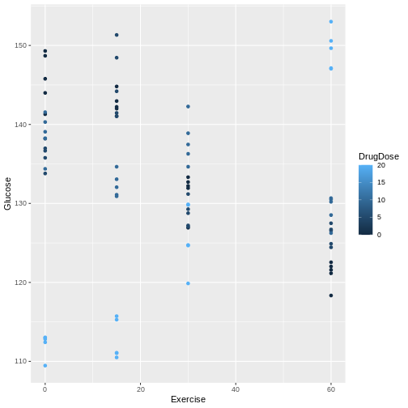
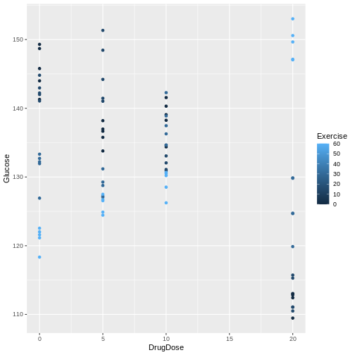

::::::::::::::::::::::::::::::::::::::: objectives

- .
- .

::::::::::::::::::::::::::::::::::::::::::::::::::

:::::::::::::::::::::::::::::::::::::::: questions

- How is a CRD with more than one treatment factor designed and analyzed?

::::::::::::::::::::::::::::::::::::::::::::::::::

experiment structured by two or more factors that can be qualitative or quantitative. Same design issues - which factors to choose, which levels? A full factorial experiment includes all levels of all factors,
which can become unwieldy when there are many levels for each factor. There are options to use only a fraction of the factor levels. Let's consider full factorial experiment here.


``` r
drugExercise <- read.csv("data/drugExercise.csv")

drugExercise %>% 
  group_by(Exercise, DrugDose) %>% 
  summarise(mean = mean(Glucose))
```

``` output
# A tibble: 16 × 3
# Groups:   Exercise [4]
   Exercise DrugDose  mean
      <int>    <int> <dbl>
 1        0        0  146.
 2        0        5  136.
 3        0       10  139.
 4        0       20  112.
 5       15        0  143.
 6       15        5  145.
 7       15       10  132.
 8       15       20  113.
 9       30        0  131.
10       30        5  129.
11       30       10  138.
12       30       20  126.
13       60        0  121.
14       60        5  126.
15       60       10  129.
16       60       20  149.
```

``` r
drugExercise %>% 
  group_by(DrugDose, Exercise) %>% 
  summarise(mean = mean(Glucose))
```

``` output
# A tibble: 16 × 3
# Groups:   DrugDose [4]
   DrugDose Exercise  mean
      <int>    <int> <dbl>
 1        0        0  146.
 2        0       15  143.
 3        0       30  131.
 4        0       60  121.
 5        5        0  136.
 6        5       15  145.
 7        5       30  129.
 8        5       60  126.
 9       10        0  139.
10       10       15  132.
11       10       30  138.
12       10       60  129.
13       20        0  112.
14       20       15  113.
15       20       30  126.
16       20       60  149.
```

``` r
drugExercise %>% 
  ggplot(aes(Exercise, Glucose)) + 
  geom_point(aes(color = DrugDose))
```



``` r
drugExercise %>% 
  ggplot(aes(DrugDose, Glucose)) + 
  geom_point(aes(color = Exercise))
```



## Interaction between factors
We could analyze these data as if it were simply a completely randomized design
with 16 treatments (4 drug doses and 4 exercise durations). The ANOVA would have 
15 degrees of freedom for treatments and the F-test would tell us whether the 
variation among average glucose levels for the 16 treatments was real or random.
However, the factorial treatment structure lets us separate out the variability
among drug doses averaged over exercise durations. The ANOVA table would provide 
a sum of squares based on 3 degrees of freedom for the difference between the 4 
treatment means ($\bar{y}_i$) and the pooled (overall) mean ($\bar{y}$).  

Sum of squares for 16 treatments: $n\sum(\bar{y}_i - \bar{y})^2$. 

The sum of squares would capture the variability among the drug dose levels.
The variation among the 4 exercise levels would be captured similarly, with 3
degrees of freedom. That leaves 15 - 6 = 9 degrees of freedom left over. What 
variability do these remaining 9 degrees of freedom contain? The answer is
interaction - the interaction between drug doses and exercise durations. We can
visualize this with an interaction plot that shows mean glucose levels for all
combinations of drug dose and exercise duration. Mean glucose for each of the 16 
treatments is given in the table below.


``` output
`summarise()` has grouped output by 'Exercise'. You can override using the
`.groups` argument.
```


Table: Drug Dose

| Exercise|        0|        5|       10|       20|
|--------:|--------:|--------:|--------:|--------:|
|        0| 145.8128| 136.2784| 138.7135| 112.1456|
|       15| 142.6130| 145.2936| 132.3528| 112.7274|
|       30| 131.4189| 128.6983| 137.9099| 125.7940|
|       60| 121.1295| 126.0156| 129.2298| 149.4863|


``` r
# Interaction plot
interaction.plot(x.factor = data$DrugDose,
                 trace.factor = data$Exercise,
                 response = data$Glucose,
                 fun = mean,
                 col = hcl.colors(4),
                 xlab = "Drug Dose (mg/kg)",
                 ylab = "Mean Blood Glucose (mg/dL)",
                 trace.label = "Exercise Duration (min)")
```

``` error
Error in data$DrugDose: object of type 'closure' is not subsettable
```

The interaction plot shows wide variation in mean blood glucose at a drug dose 
of zero. At 20 mg/kg dose, two of the exercise groups have very low blood 
glucose - the zero exercise group and the 15 minute exercise group. For the 60 
minute exercise group, blood glucose increases with drug dose.


``` r
interaction.plot(x.factor = data$Exercise,
                 trace.factor = data$DrugDose,
                 response = data$Glucose,
                 fun = mean,
                 col = hcl.colors(4),
                 xlab = "Exercise (min)",
                 ylab = "Mean Blood Glucose (mg/dL)",
                 trace.label = "DrugDose (mg/kg)")
```

``` error
Error in data$Exercise: object of type 'closure' is not subsettable
```

This second interaction plot shows generally declining mean blood glucose with
increased exercise for the 0, 5, and 10 mg/kg drug dosage groups. For the 20 
mg/kg group, mean glucose levels increase dramatically with increased exercise.
If lines were parallel we could assume no interaction between drug and exercise. 
Since they are not  parallel we should assume interaction between exercise and 
drug dose. The F-test from an ANOVA will tell us whether this apparent 
interaction is real or random, specifically whether it is more pronounced than 
would be expected due to random variation.


``` r
# DrugDose*Exercise is the interaction
anova(lm(Glucose ~ DrugDose + Exercise + DrugDose*Exercise, 
         data = drugExercise))
```

``` output
Analysis of Variance Table

Response: Glucose
                  Df Sum Sq Mean Sq  F value    Pr(>F)    
DrugDose           1 1132.1  1132.1  41.4888 9.717e-09 ***
Exercise           1   47.6    47.6   1.7456    0.1904    
DrugDose:Exercise  1 6465.2  6465.2 236.9247 < 2.2e-16 ***
Residuals         76 2073.9    27.3                       
---
Signif. codes:  0 '***' 0.001 '**' 0.01 '*' 0.05 '.' 0.1 ' ' 1
```

We can read the ANOVA table from the bottom up, starting with the interaction
(`DrugDose:Exercise`). The `F value` for the interaction is 
236.9
on 
1
and 
76
degrees of freedom for the interaction and error (`Residuals`)
respectively. The p-value (`Pr(>F)`) is near zero and as such the interaction
between exercise and drug dose is significant, backing up what we see in the 
interaction plots. If we move up a row in the table to Exercise, the F test 
compares the exercise means across drug dose groups. The `F value` for exercise
is 
1.7
on 
1
and 
76
degrees of freedom for exercise and residuals respectively. The 
p-value  is low at
0.19
and is significant. Finally, we move up to the row containing `DrugDose` to
find an F value of 
41.5
and a p-value very near zero again. Drug dose averaged over exercise is 
significant.  
The partitioning of treatments sums of squares into main effect (average) and 
interaction sums of squares is a result of the crossed factorial structure of 
the two factors. The development of efficient and informative multifactor 
designs that provide clean partitioning between main effects and interactions
is one of the most important contributions of statistical experimental design.

:::::::::::::::::::::::::::::::::::::::: keypoints

- Completely randomized designs can be structured with two or more factors.
- Random assignment of treatments to experimental units in a single homogeneous group is the same.
- Factorial structure of the experiment requires different analyses, primarily
ANOVA.

::::::::::::::::::::::::::::::::::::::::::::::::::


