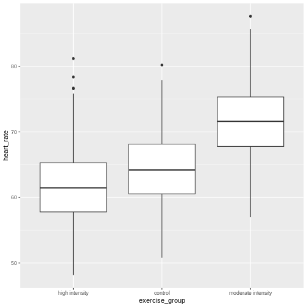
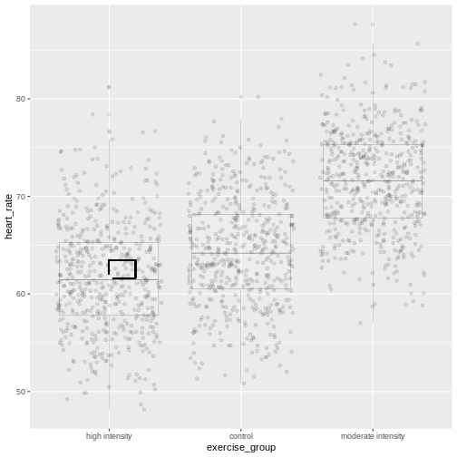

::::::::::::::::::::::::::::::::::::::: objectives

- CRD is the simplest experimental design.
- In CRD, treatments are assigned randomly to experimental units.
- CRD assumes that the experimental units are relatively homogeneous or similar.
- CRD doesn't remove or account for systematic differences among experimental units.

::::::::::::::::::::::::::::::::::::::::::::::::::

:::::::::::::::::::::::::::::::::::::::: questions

- What is a completely randomized design (CRD)?
- What are the limitations of CRD?

::::::::::::::::::::::::::::::::::::::::::::::::::


A completely randomized design (CRD) is the simplest experimental design. In 
CRD, experimental units are randomly assigned to treatments with equal 
probability. Any systematic differences between experimental units (e.g. 
differences in measurement protocols, equipment calibration, personnel) are
minimized, which minimizes confounding. CRD is simple, however it can result in 
larger experimental error compared to other designs if experimental units are 
not similar. This means that the variation among experimental units that receive
the same treatment (i.e. variation within a treatment group) will be greater. In
general though, CRD is a straightforward experimental design that effectively minimizes systematic errors through randomization.

## A single qualitative factor
The [Generation 100 study](https://bmjopen.bmj.com/content/5/2/e007519)
employed a single qualitative factor (exercise) at three treatment levels - high
intensity, moderate intensity and a control group that followed national 
exercise recommendations. The experimental units were the individuals in the
study who engaged in one of the treatment levels.

:::::::::::::::::::::::::::::::::::::::  challenge

## Challenge 1: Raw ingredients of a comparative experiment

Discuss the following questions with your partner, then share your answers
to each question in the collaborative document.

1. How would you randomize the 1,500+ individuals in the study to one of the
treatment levels?  
2. Is blinding possible in this study? If not, what are the consequences of
not blinding the participants or investigators to treatment assignments?  
3. Is CRD a good design for this study? Why or why not?  

:::::::::::::::  solution

## Solution

1. How would you randomize the 1,500+ individuals in the study to one of the
treatment levels?  
You can use a random number generator like we did previously to assign all
individuals to one of three treatment levels.  
2. Is blinding possible in this study? If not, what are the consequences of
not blinding the participants or investigators to treatment assignments?  
Blinding isn't possible because people must know which treatment they have been
assigned so that they can exercise at the appropriate level. There is a risk of
response bias from participants knowing which treatment they have been assigned.
The investigators don't need to know which treatment group an individual is in,
however, so they could be blinded to the treatments to prevent reporting bias 
from entering when following study protocols. In either case random assignment
of participants to treatment levels will minimize bias.  
3. Is CRD a good design for this study? Why or why not?  
CRD is best when experimental units are homogeneous or similar. In this study,
all individuals were between the ages of 70-77 years and all lived in 
Trondheim, Norway. They were not all of the same sex, however, and sex will
certainly affect the study outcomes and lead to greater experimental error
within each treatment group. Stratification, or grouping, by sex followed by 
random assignment to treatments within each stratum would alleviate this 
problem. So, randomly assigning all women to one of the three treatment groups, 
then randomly assigning all men to one of the three treatment groups would be 
the best way to handle this situation.  
In addition to stratification by sex, the Generation 100 investigators 
stratified by marital status because this would also influence study outcomes.

:::::::::::::::::::::::::

::::::::::::::::::::::::::::::::::::::::::::::::::

## Analysis of variance (ANOVA)
Previously we tested the difference in means between two treatment groups, 
moderate intensity and control, using a two-sample t-test. We could continue 
using the t-test to determine whether there is a significant difference between 
high intensity and moderate intensity, and between high intensity and control 
groups. This would be tedious though because we would need to test each possible
combination of two treatment groups separately. It is also susceptible to bias.
If we were to test the difference in means between the highest and lowest heart
rate groups (high intensity vs. control), there is more than a 5% probability 
that just by random chance we can obtain a p-value less than .05. Comparing the 
highest to the lowest mean groups biases the t-test to report a statistically 
significant difference when in reality there might be no difference in means.

Analysis of variance (ANOVA) addresses two sources of variation in the data:
1) the variation within each treatment group; and 2) the variation among the
treatment groups. In the boxplots below, the variation within each treatment
group shows in the vertical length of the each box and its whiskers. The 
variation among treatment groups is shown horizontally as upward or
downward shift of the treatment groups relative to one another. ANOVA quantifies
and compares these two sources of variation.


``` r
heart_rate %>% 
  mutate(exercise_group = fct_reorder(exercise_group,
                                      heart_rate,
                                      .fun='mean'))  %>% 
  ggplot(aes(exercise_group, heart_rate)) + 
  geom_boxplot()
```


By eye it appears that there is a difference in mean heart rate between exercise
groups, and that increasing exercise intensity decreases mean heart rate. We 
want to know if there is any statistically significant difference between mean 
heart rates in the three exercise groups. The R function `anova()` performs
analysis of variance (ANOVA) to answer this question. We provide `anova()` with
a linear model (`lm()`) stating that `heart_rate` depends on `exercise_group`.


``` r
anova(lm(heart_rate ~ exercise_group, data = heart_rate))
```

``` output
Analysis of Variance Table

Response: heart_rate
                 Df Sum Sq Mean Sq F value    Pr(>F)    
exercise_group    2  26960 13480.1  451.04 < 2.2e-16 ***
Residuals      1563  46713    29.9                      
---
Signif. codes:  0 '***' 0.001 '**' 0.01 '*' 0.05 '.' 0.1 ' ' 1
```

The output tells us that there are two terms in the model we provided: 
`exercise_group` plus some experimental error (`Residuals`). The response is 
heart rate. As an equation the linear model looks like this:  

$y = \beta*x + \epsilon$

where $y$ is the response (heart rate), $x$ is the treatment (exercise group), 
$\beta$ is the effect size, and $\epsilon$ is experimental error, also called `Residuals`.

To help interpret the rest of the ANOVA output, the following table defines each
element. 


Table: ANOVA Table for Completely Randomized Design with One Treatment Factor with k levels and n Observations per Treatment

|source of variation |Df         |Sum Sq                             |Mean Sq=Sum Sq/Df |F value |prob(>F) |
|:-------------------|:----------|:----------------------------------|:-----------------|:-------|:--------|
|treatments          |$k - 1$    |$n\sum(\bar{y_i} - \bar{y_.})^2$   |TMS               |TMS/EMS |p-value  |
|error               |$k(n - 1)$ |$\sum\sum({y_{ij}} - \bar{y_i})^2$ |EMS               |        |         |
|total               |$nk - 1$   |$\sum\sum({y_{ij}} - \bar{y_.})^2$ |                  |        |         |

The source of variation *among* `treatments` is shown on the y-axis of 
the boxplots shown earlier. Treatments have $k - 1$ degrees of freedom (`Df`), 
where $k$ is the number of treatment levels. Since we have 3 exercise groups, 
the treatments have 2 degrees of freedom. Think of degrees of freedom as the 
number of values that are free to vary. Or, if you know two of the exercise 
groups, the identity of the third is revealed.  

The Sum of Squares (`Sum Sq`) for the treatment subtracts the overall mean for 
all groups from the mean for each treatment group ($\bar{y_i} - \bar{y_.}$), 
squares the difference so that only positive numbers result, then sums ($\sum$) 
all of the squared differences together and multiplies the result by the number 
of observations in each group ($n$ = 522). 
If we were to calculate the Sum of Squares manually, it would look like this:


``` r
# these are the y_i
groupMeans <- heart_rate %>% 
  group_by(exercise_group) %>% 
  summarise(mean = mean(heart_rate))
groupMeans
```

``` output
# A tibble: 3 × 2
  exercise_group      mean
  <chr>              <dbl>
1 control             64.2
2 high intensity      61.7
3 moderate intensity  71.5
```

``` r
# this is y.
overallMean <- heart_rate %>%
  summarise(mean = mean(heart_rate))
overallMean
```

``` output
# A tibble: 1 × 1
   mean
  <dbl>
1  65.8
```

``` r
# sum the squared differences and multiply the sum by n
((groupMeans$mean[1] - overallMean)^2 + 
    (groupMeans$mean[2] - overallMean)^2 + 
    (groupMeans$mean[3] - overallMean)^2) * 522
```

``` output
      mean
1 26960.22
```

The source of variation *within* treatments is called `error` (`Residuals`), 
meaning the variation among experimental units within the same treatment group. 
The degrees of freedom (`Df`) for error equals $k$, the number of treatment 
levels, times $n - 1$, one less than the number of observations in each group.
For this experiment $k = 3$ and $n - 1 = 521$ so the degrees of freedom for the
error equals 1563. If you know 521 of the data points in an exercise group, the 
identity of number 522 is revealed. Each of the 3 exercise groups has 521 
degrees of freedom, so the total degrees of freedom for error is 1563. The Sum
of Squares for error is the difference between each data point, $y_{ij}$ and the
group mean $\bar{y_i}$. This difference is squared and the sum of all squared 
differences calculated for each exercise group $i$.

In the boxplots below, each individual data point, $y_{ij}$, is shown as a gray
dot. The group mean, $\bar{y_i}$, is shown as a red dot. Imagine drawing a box 
that has one corner on the group mean for high-intensity exercise 
(61.7) and another corner on a single data point 
nearby. The area of this box represents the difference between the group mean 
and the data point squared, or $(y_{ij} - \bar{y_i})^2$. Repeat this
for all 522 data points in the group, then sum up ($\sum$) the areas of all the 
boxes for that group. Repeat the process with the other two groups, then add all 
of the group sums ($\sum\sum$) together. 



This used to be a manual process. Fortunately R does all of this labor for us. 
The ANOVA table tells us that the sum of all squares for all groups equals 
4.6713\times 10^{4}.

The mean squares values (`Mean Sq`) divides the Sum of Squares by the degrees of 
freedom. The treatment mean squares, TMS, equals 

(
26960 
/ 
2 
= 
1.34801\times 10^{4}
). 

The treatment mean square is a measure of the variance among the treatment 
groups, which is shown horizontally in the boxplots as upward or downward shift 
of the treatment groups relative to one another.

The error mean square, EMS, similarly is the Sum of Squares divided by the
degrees of freedom, or
(4.6713\times 10^{4})
divided by 
(1563).
Error mean square is an estimate of variance within the groups, which is shown 
in the vertical length of the each boxplot and its whiskers.

The `F value`, or F statistic, equals the treatment mean square divided by the
error mean square, or among-group variation divided by within-group variation
(1.348\times 10^{4} /
30 = 
451.04).

`F value` = among-group variance / within-group variance

These variance estimates are statistically independent of one another, such that 
you could move any of the three boxplots up or down and this would not affect 
the within-group variance. Among-group variance would change, but not 
within-group variance. 


## Equal variances and normality
:::::::::::::::::::::::::::::::::::::::  challenge

## Challenge 2: Checking for equal variances and normality

A one-way ANOVA assumes that:  
1. variances of the populations that the samples come from are equal,  
2. samples were drawn from a normally distributed population, and  
3. observations are independent of each other and observations 
within groups were obtained by random sampling.

Discuss the following questions with your partner, then share your answers
to each question in the collaborative document.

1. How can you check whether variances are equal?  
2. How can you check whether data are normally distributed?  
3. How can you check whether each observation is independent of the other and
groups randomly assigned?   

:::::::::::::::  solution

## Solution

1. How can you check whether variances are equal?  
A visual like a boxplot can be used to check whether variances are equal. 

```
heart_rate %>% 
  mutate(exercise_group = fct_reorder(exercise_group, 
                                      heart_rate, 
                                      .fun='mean', 
                                      .desc = TRUE))  %>% 
  ggplot(aes(exercise_group, heart_rate)) + 
  geom_boxplot()
```

If the length of the boxes are more or less equal, then equal variances can be 
assumed.  
2. How can you check whether data are normally distributed?  
You can visually check this assumption with histograms or Q-Q plots. Normally
distributed data will form a more or less bell-shaped histogram.

```
heart_rate %>% 
  ggplot(aes(heart_rate)) + 
  geom_histogram()
```

Normally distributed data will mostly fall upon the diagonal line in a Q-Q 
plot.

```
qqnorm(heart_rate$heart_rate)
qqline(heart_rate$heart_rate)
```

3. How can you check whether each observation is independent of the other and
groups randomly assigned? 

:::::::::::::::::::::::::

::::::::::::::::::::::::::::::::::::::::::::::::::

:::::::::::::::::::::::::::::::::::::::::: spoiler

### More formal tests of normality and equal variances

More formal tests of normality and equal variance include the Bartlett test, 
Shapiro-Wilk test and the Kruskal-Wallis test.

The Bartlett test of homogeneity of variances tests the null hypothesis that the 
samples have equal variances against the alternative that they do not. 

```r
bartlett.test(heart_rate ~ exercise_group, data = heart_rate)
```
In this case the p-value is greater than the alpha level of 0.05. This suggests 
that the null should not be rejected, or in other words that samples have equal 
variances. One-way ANOVA is robust against violations of the equal variances 
assumption as long as each group has the same sample size. If variances are very 
different and sample sizes unequal, the Kruskal-Wallis test (`kruskal.test()`) 
determines whether there is a statistically significant difference between the 
medians of three or more independent groups.

The Shapiro-Wilk Normality Test tests the null hypothesis that the samples come 
from a normal distribution against the alternative hypothesis that samples don't 
come from a normal distribution. 

```r
shapiro.test(heart_rate$heart_rate)
```

In this case the p-value of the test is less than the alpha level of 0.05,
suggesting that the samples do not come from a normal distribution. With very 
large sample sizes statistical tests like the Shapiro-Wilk test will almost 
always report that your data are not normally distributed. Visuals like 
histograms and Q-Q plots should clarify this. However, one-way ANOVA is robust 
against violations of the normality assumption as long as sample sizes are quite 
large. 

If data are not normally distributed, or if you just want to be cautious, you 
can:

1. Transform the response values in your data so that they are more normally 
distributed. A log transformation (`log10(x)`) is one method for transforming
response values to a more normal distribution.

2. Use a non-parametric test like a Kruskal-Wallis Test that doesn’t require 
assumption of normality.

::::::::::::::::::::::::::::::::::::::::::::::::::


## Confidence intervals
The boxplots show that high-intensity exercise results in lower average heart
rate. 


``` r
heart_rate %>% 
  group_by(exercise_group) %>% 
  summarise(mean = mean(heart_rate))
```

``` output
# A tibble: 3 × 2
  exercise_group      mean
  <chr>              <dbl>
1 control             64.2
2 high intensity      61.7
3 moderate intensity  71.5
```

To generalize these results to the entire population of Norwegian elders, we can 
examine the imprecision in this estimate using a confidence interval for mean
heart rate. We could use only the high-intensity group data to create a 
confidence interval, however, we can do better by "borrowing strength" from
all groups. We know that the underlying variation in the groups is the same for
all three groups, so we can estimate the common standard deviation. ANOVA has
already done this for us by supplying error mean square 
(29.9)
as the pooled estimate of the variance. The standard deviation is the square 
root of this value 
(5.47).
The fact that we "borrowed strength" by including all groups is reflected in the
degrees of freedom, which is 
1563 for the 
sample standard deviation instead of `n - 1` for the sample variance of only one 
group. This makes the test more powerful because it borrows information from all 
groups.
We use the sample standard deviation to calculate a 95% confidence interval for
mean heart rate in the high-intensity group.


``` r
confint(lm(heart_rate ~ exercise_group, data = heart_rate))
```

``` output
                                     2.5 %    97.5 %
(Intercept)                      63.773648 64.712331
exercise_grouphigh intensity     -3.182813 -1.855314
exercise_groupmoderate intensity  6.603889  7.931388
```

The results provide us with the 95% confidence interval for the mean in the 
control group (`Intercept`), meaning that 95% of confidence intervals generated 
will contain the true mean value. Confidence intervals for the high- and
moderate-intensity groups are given as values to be added to the intercept 
values. The 95% confidence interval for the high-intensity group is from 
60.6
to 
62.9.
The 95% confidence interval for the moderate-intensity group is from 
70.4
to 
72.6.

## Inference
Inference about the underlying difference in means between exercise groups 
is a statement about the difference between normal distribution means that 
could have resulted in the data from this experiment with 
1566 Norwegian elders. Broader inference relies on how this
sample of Norwegian elders relates to all Norwegian elders. If this sample of 
Norwegian elders were selected at random nationally, then the inference could be 
broadened to the larger population of Norwegian elders. Otherwise broader 
inference requires subject matter knowledge about how this sample relates to all 
Norwegian elders and to all elders worldwide.

## Statistical Prediction Interval
To create a confidence interval for the group means we used a linear model that
states that heart rate is dependent on exercise group.


``` r
lm(heart_rate ~ exercise_group, data = heart_rate)
```

``` output

Call:
lm(formula = heart_rate ~ exercise_group, data = heart_rate)

Coefficients:
                     (Intercept)      exercise_grouphigh intensity  
                          64.243                            -2.519  
exercise_groupmoderate intensity  
                           7.268  
```
This effectively states that mean heart rate is 
64.2
less 
7.27 for 
the moderate-intensity group or
-2.52
for the high-intensity group. We can use this same linear model to predict 
mean heart rate for a new group of participants.


``` r
### save the linear model as an object
model <- lm(heart_rate ~ exercise_group, data = heart_rate)
### predict heart rates for a new group of controls
predict(model, 
        data.frame(exercise_group = "control"), 
        interval = "prediction", 
        level = 0.95)
```

``` output
       fit      lwr      upr
1 64.24299 53.50952 74.97646
```

Notice that in both the confidence interval and prediction interval, the predicted value for mean heart rate in controls is the same - 
64.2.
However, the prediction interval is much wider than the confidence interval. The 
confidence interval defines a range of values likely to contain the true average 
heart rate for the control group. The prediction interval defines the expected 
range of heart rate values for a future individual participant in the control 
group and is broader since there can be considerably more variation in 
individuals. The difference between these two kinds of intervals is the question
that they answer.

1. What interval is likely to contain the true average heart rate for controls?
OR
1. What interval predicts the average heart rate of a future participant in the 
control group?

Notice that for both kinds of intervals we used the same linear model that 
states that heart rate depends on exercise group. 


``` r
lm(heart_rate ~ exercise_group, data = heart_rate)
```

``` output

Call:
lm(formula = heart_rate ~ exercise_group, data = heart_rate)

Coefficients:
                     (Intercept)      exercise_grouphigh intensity  
                          64.243                            -2.519  
exercise_groupmoderate intensity  
                           7.268  
```

We know that the study
contains both sexes between the ages of 70 and 77. Completely randomized designs
assume that experimental units are relatively similar, and the designs don't 
remove or account for systematic differences. We should add sex into the linear 
model because heart rate is likely influenced by sex. We can get more 
information about the linear model with a `summary()`.


``` r
summary(lm(heart_rate ~ exercise_group + sex, data = heart_rate))
```

``` output

Call:
lm(formula = heart_rate ~ exercise_group + sex, data = heart_rate)

Residuals:
     Min       1Q   Median       3Q      Max 
-14.1497  -3.7688  -0.0809   3.7338  19.1398 

Coefficients:
                                 Estimate Std. Error t value Pr(>|t|)    
(Intercept)                       64.5753     0.2753 234.530  < 2e-16 ***
exercise_grouphigh intensity      -2.5191     0.3379  -7.456 1.47e-13 ***
exercise_groupmoderate intensity   7.2676     0.3379  21.511  < 2e-16 ***
sexM                              -0.6697     0.2759  -2.428   0.0153 *  
---
Signif. codes:  0 '***' 0.001 '**' 0.01 '*' 0.05 '.' 0.1 ' ' 1

Residual standard error: 5.458 on 1562 degrees of freedom
Multiple R-squared:  0.3683,	Adjusted R-squared:  0.3671 
F-statistic: 303.6 on 3 and 1562 DF,  p-value: < 2.2e-16
```
The linear model including sex states that average heart rate for the control
group is 
64.6
less 
7.27 
for the moderate-intensity group or
-2.52
for the high-intensity group. Males have heart rates that are
-0.67
from mean control heart rate. The p-values (`Pr(>|t|)`) are near zero for all
of the estimates (model coefficients). Exercise group and sex clearly impact 
heart rate. What about age?


``` r
summary(lm(heart_rate ~ exercise_group + sex + age, data = heart_rate))
```

``` output

Call:
lm(formula = heart_rate ~ exercise_group + sex + age, data = heart_rate)

Residuals:
     Min       1Q   Median       3Q      Max 
-14.3515  -3.7707  -0.1119   3.7359  19.2649 

Coefficients:
                                 Estimate Std. Error t value Pr(>|t|)    
(Intercept)                       84.6122    10.1667   8.323  < 2e-16 ***
exercise_grouphigh intensity      -2.5144     0.3376  -7.449 1.55e-13 ***
exercise_groupmoderate intensity   7.2652     0.3376  21.523  < 2e-16 ***
sexM                              -0.6735     0.2756  -2.443   0.0147 *  
age                               -0.2753     0.1397  -1.972   0.0488 *  
---
Signif. codes:  0 '***' 0.001 '**' 0.01 '*' 0.05 '.' 0.1 ' ' 1

Residual standard error: 5.453 on 1561 degrees of freedom
Multiple R-squared:  0.3699,	Adjusted R-squared:  0.3683 
F-statistic: 229.1 on 4 and 1561 DF,  p-value: < 2.2e-16
```
We can add age into the linear model to determine whether or not it impacts
heart rate. The estimated coefficient for age is small 
(-0.28)
and has a high p-value 
(0.05).
Age is not significant, which is not surprising since all participants were 
between the ages of 70 and 77. The linear model that best fits the data includes
only exercise group and sex.

## Sizing a Complete Random Design 
The same principles apply for sample sizes and power calculations as were 
presented earlier. Typically a completely randomized design is analyzed to 
estimate precision of a treatment mean or the difference of two treatment means.
Confidence intervals or power curves can be applied to sizing a future 
experiment.
If we want to size a future experiment comparing heart rate between control and
moderate-intensity exercise, what is the minimum number of people we would need
per group in order to detect an effect as large as the mean heart rate
difference from this experiment?


``` r
# delta = the observed effect size between groups
# sd = standard deviation
# significance level (Type 1 error probability or false positive rate) = 0.05
# type = two-sample t-test
# What is the minimum sample size we would need at 80% power?

controlMean <- heart_rate %>%
  filter(exercise_group == "control") %>%
  summarise(mean = mean(heart_rate)) 
moderateMean <- heart_rate %>%
  filter(exercise_group == "moderate intensity") %>%
  summarise(mean = mean(heart_rate)) 
delta <- controlMean - moderateMean
power.t.test(delta = delta[[1]], sd = sd(heart_rate$heart_rate), 
             sig.level = 0.05, type = "two.sample", power = 0.8)
```

``` output

     Two-sample t test power calculation 

              n = 15.01468
          delta = 7.267638
             sd = 6.861167
      sig.level = 0.05
          power = 0.8
    alternative = two.sided

NOTE: n is number in *each* group
```
To obtain an effect size as large as the observed effect size between control
and moderate-intensity exercise groups, you would need 
15
participants per group to obtain 80% statistical power.

Would you expect to need more or fewer participants per group to investigate
the difference between control and high-intensity exercise on heart rate?
Between moderate- and high-intensity?

## A Single Quantitative Factor

## Design issues

factor levels? two levels and connect a line? nature can throw you a curve so 
choose intermediate levels between two levels known from previous studies
replicates per level?


:::::::::::::::::::::::::::::::::::::::: keypoints

- CRD is a simple design that can be used when experimental units are homogeneous.

::::::::::::::::::::::::::::::::::::::::::::::::::


